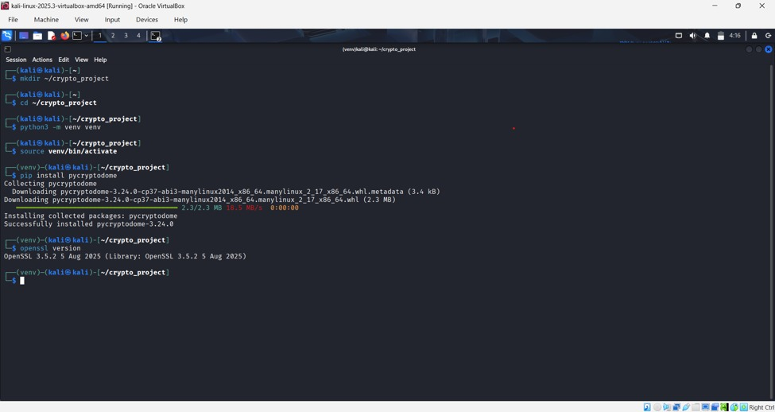
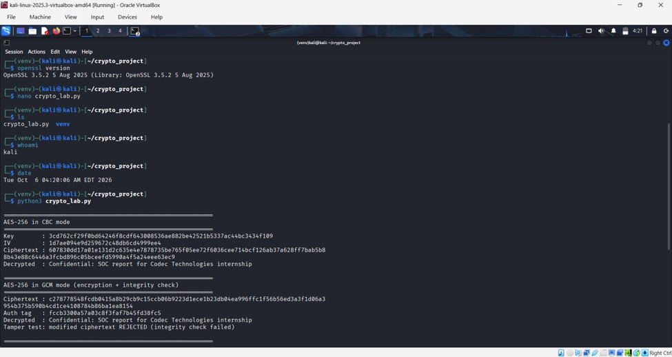
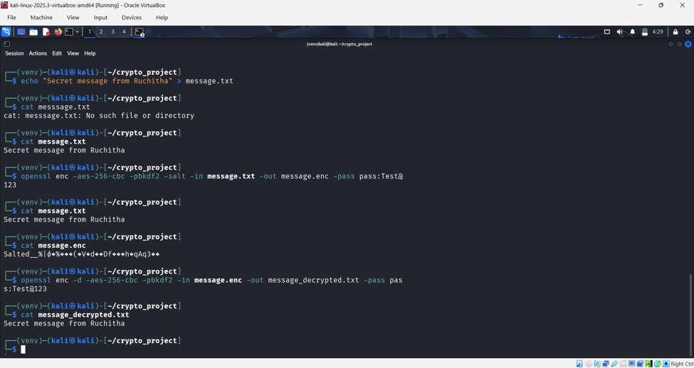

# Cryptography Algorithms Implementation (AES, RSA, SHA)

Project 6 of the Cybersecurity Internship at Codec Technologies.

## Objective
Implement popular cryptography algorithms (AES, RSA, SHA) to understand
encryption and decryption processes.

## Tools Used
- Kali Linux
- Python 3 with PyCryptodome
- OpenSSL

## What I Implemented
- AES-256 (CBC and GCM): symmetric encryption, plus tamper detection with GCM
- RSA-2048: encryption and decryption with OAEP padding, and digital signatures with PSS
- SHA-1, SHA-256, SHA-512: hashing, the avalanche effect and file integrity checking
- The same operations repeated using the OpenSSL command line

## How to Run
    pip install pycryptodome
    python3 crypto_lab.py

## Screenshots

### 1. Environment setup

### 2. Python: AES-CBC and AES-GCM

### 3. Python: RSA and SHA

### 4. OpenSSL: AES

### 5. OpenSSL: RSA and SHA

## Skills Learned
Cryptography fundamentals, symmetric vs asymmetric encryption, hashing,
digital signatures, secure communication protocols.

## Author
A P Ruchitha
